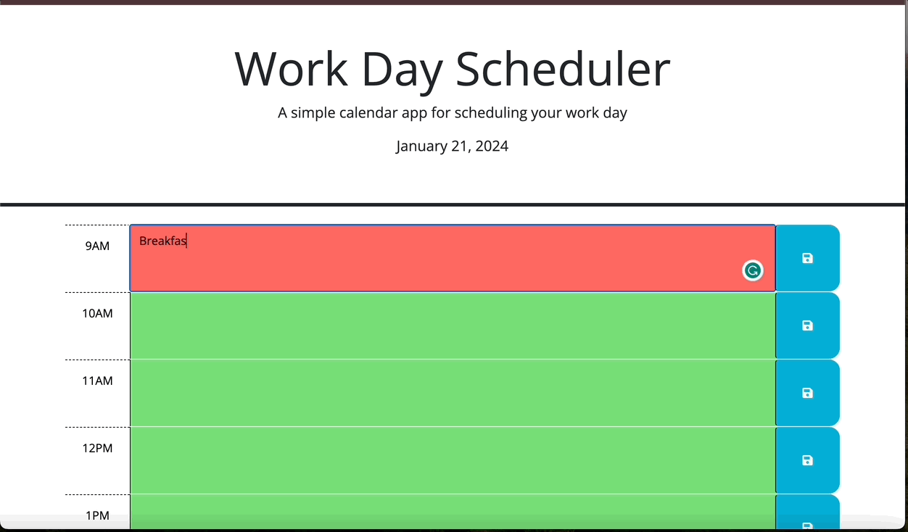

# Work Scheduler

## Description

This is a basic Work Day scheduler that allows users to save events for each hour of a typical 9am - 5pm work day. Text Boxes are color coated to represent current, past and future events.
Red = Current Events, Green = Future Events, and Gray = Past Events.

**Link to the Work Scheduler**: https://nlopez39.github.io/Work-Scheduler/

## Usage

1. **Look at Events**: Launch the Work Scheduler on your device to see the layout of past, future and current events scheduled for the day.
2. **Edit Events**: Enter or edit important events into the event box for differnt hours of the day.
3. **Save Events**: Save your event by clicking the blue save button. Once saved, you will receive an alert to indicate that the event was saved successfully.

   

## Installation

Follow these steps to set up and run the project locally on your machine.

### Clone the Repository

1. Open your terminal or command prompt.

2. Navigate to the directory where you want to store the project:

   ```bash
   cd path/to/your/directory
   ```

3. Clone the repository:

   ```bash
   git clone git@github.com:nlopez39/Work-Scheduler.git
   ```

### Install Dependencies

1. Navigate to the project directory:

   ```bash
   cd your-project
   ```

2. Install project dependencies:

   ```bash
   npm install
   ```

### Run the Project

Once the installation is complete, you can run the project:
`bash
    npm start 
    `

## Credits

https://learn.jquery.com/events/event-delegation/
https://api.jquery.com/category/traversing/
https://api.jquery.com/text/
https://www.geeksforgeeks.org/difference-between-this-and-this-in-jquery/

## License

Please refer to the LICENSE in the repository
